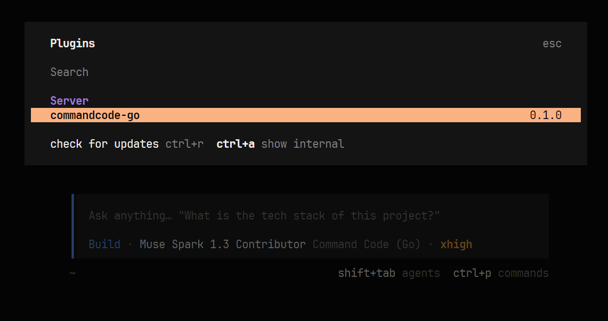
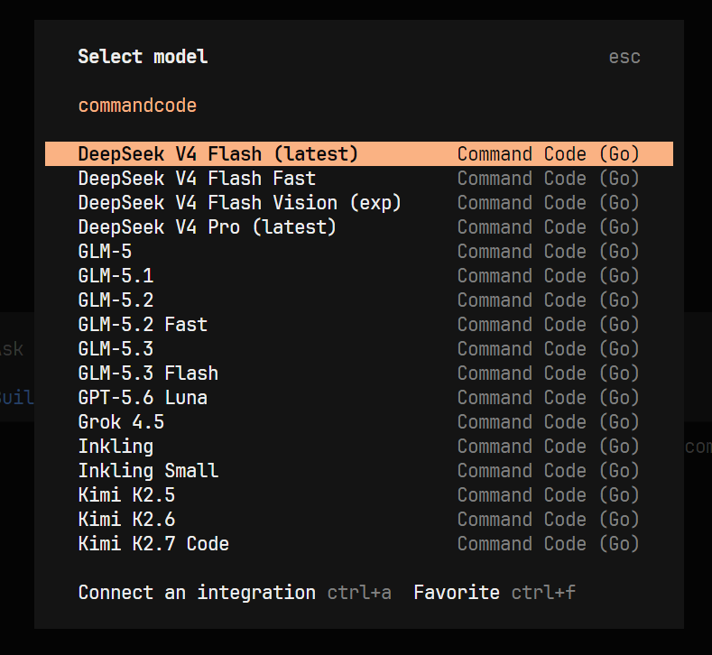
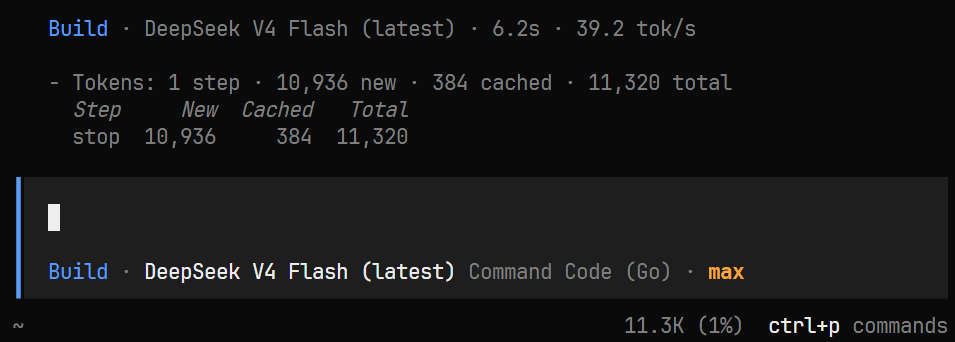
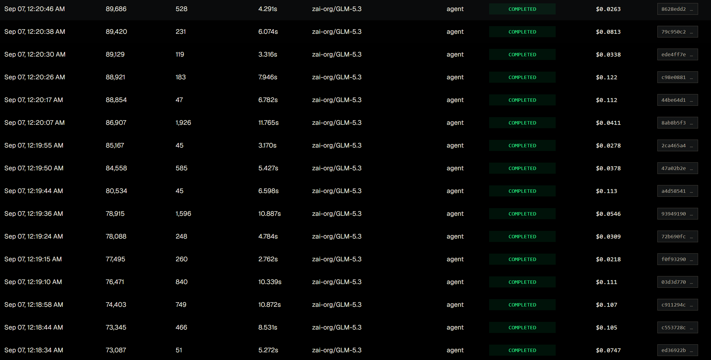

# 宣传帖核心长文（NodeSeek / linux.do / V2EX 共用骨架）

> 使用说明：三平台共用此正文，只按 `titles.md` 换标题；正文中的图片为相对路径引用，发布到论坛时手动上传 `assets/` 下的三张图和 GLM 波动图即可。

---

前段时间刷到 CommandCode 的 Go plan：$1/月（算上手续费约 $1.4），给 $10 的模型额度，部分模型还有 2×–5× 的优惠倍率（比如 MiMo V2.5 Pro 实际能用到约 $50）。对比 OpenCode Go（$10/月，多数模型 $60 额度），光是调用 dsv4 来用的话也不赖，比梁文峰梁文谷的价格便宜多了。

但是 CommandCode 最便宜的那一档订阅套餐（也就是 Go 套餐）并没有提供第三方 API 接入，只能使用他自家的 commandcode cli 来使用。这个 cli 感觉还行，但我还是习惯了使用 opencode，所以我试了一下现有的反代方案（ https://github.com/MAXeaglet/commandcode-proxy ），打算在 opencode 里面使用这个套餐。但折腾了半天都没成功接入，opencode 里边模型一直在报错，连思考都没有。所以我才产生了写一个轮子的想法。

因此花了大概一周的时间搓了一个能够将 commandcode go plan 的私有端点桥接到 opencode 中并注册成一个 provider 的插件

## 这是什么

这是一个 opencode 的插件，同时兼容 v1 和 v2（beta）版本，桥接了 Command Code Go plan 的私有端点，注册成一个 provider，允许在 opencode 里直接使用 Command Code 的模型

GitHub 链接： https://github.com/WallBreakerNO4/opencode-commandcode-provider ，欢迎 star 和提 issue。

## 怎么装

前置：一个 Command Code Go plan 订阅，并在 Studio → API Keys 生成 API key（和 CLI 用的是同一把）。

**方式一（推荐）：把这段话直接粘进 OpenCode 会话，让 agent 自己装：**

```
按照这份指南安装 @wallbreakerno4/opencode-commandcode 插件：
https://raw.githubusercontent.com/WallBreakerNO4/opencode-commandcode-provider/main/docs/guide/installation.md
```

**方式二：OpenCode v2（beta）一行命令：**

```bash
opencode2 plugin add @wallbreakerno4/opencode-commandcode
```

（beta 限制：还需在 `opencode.json` 里合入 `"providers": { "commandcode-go": {} }` 一行空壳。）

**方式三：OpenCode v1，配置文件里加一行：**

```json
{ "plugin": ["@wallbreakerno4/opencode-commandcode"] }
```

装完重启宿主，输入 `/connect` 选 Command Code (Go) 粘贴 key 登录（或设环境变量 `COMMANDCODE_API_KEY`）。

验证：

```bash
opencode run --model commandcode-go/deepseek/deepseek-v4-pro "hi"
```

插件装好后，插件列表里就能看到 `commandcode-go`：



模型选择器里直接出现一整屏 Command Code (Go) 模型：



随手跑一轮真实对话：



## ⚠️ commandcode 官方 api 的一个坑

目前 Command Code 上游 API 的 **GLM 系列模型缓存命中率不稳定**——同一编码会话里上下文高度重复、理论上应持续命中缓存，实测一轮会话的综合命中率却只有约 54%（编码 agent 场景一般需要 90%+ 才合理），单次请求价格在 $0.02～$0.12 之间反复跳动，额度消耗明显偏快。



这是上游 API 侧的问题，修不了。**额度敏感的日常使用，建议直接选 deepseek 系列**，缓存命中稳定，消耗平缓。详细可见项目的[已知问题文档](https://github.com/WallBreakerNO4/opencode-commandcode-provider/blob/main/docs/guide/known-issues.md)。

## 最后

这不是官方的插件，仅供学习使用，风险自负

本项目参考了 https://github.com/MAXeaglet/commandcode-proxy 中的反代实现

如有问题，欢迎在 GitHub 上提 issue